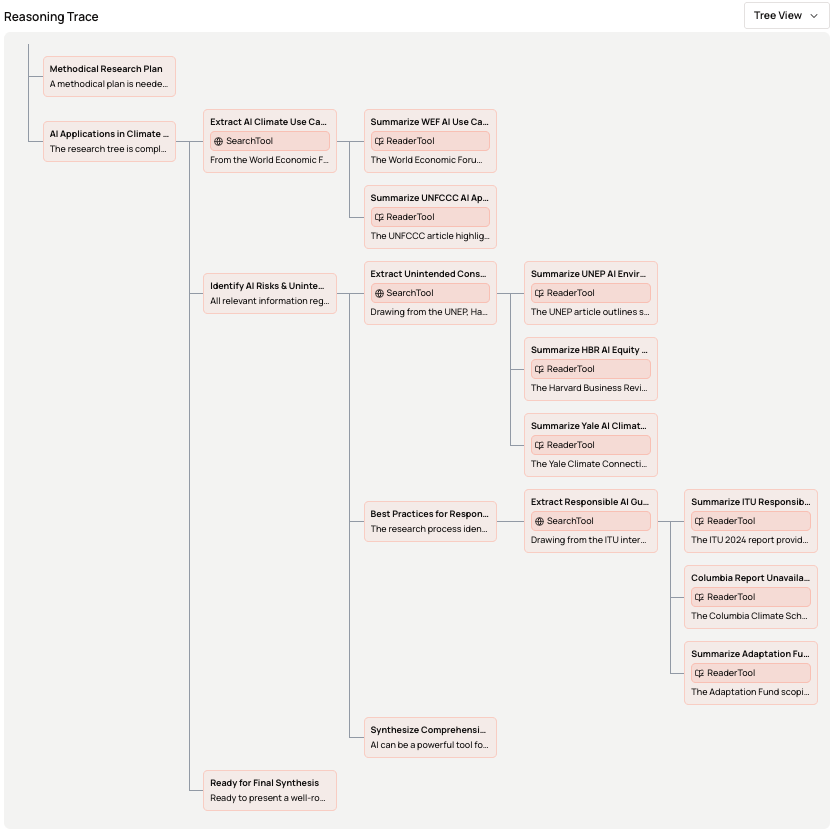
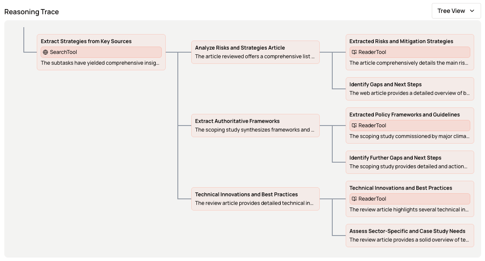

# Deep Research Example
> This example demonstrates how to build a deep research agent using the Subconscious TIM framework. The agent can perform multi-step research tasks by utilizing a search tool and synthesizing information from multiple sources with or with any extend of control over the reasoning structure.

In [agent.py](agent.py), we provided two different implementations of the deep research agent:
- `flex_deep_research`: A flexible deep research agent that allows the model to decide how to structure the reasoning and tool use dynamically.
- `controlled_deep_research`: A controlled deep research agent that defines some rough reasoning structure for the model to follow.
  - The control we ask for:
    1. For each search result, read the webpage and summarize the key points in subtasks.
    2. If further exploration is needed, suggest another search query and end the current subtask.
  - The flexibilities we grant:
    1. The model can decide how many search iterations to perform.
    2. The model can decide when to stop the research and provide a final synthesis.

## The journey of flexibility control
Deep research agents should be as flexible as possible, but we are just using this simple example to demonstrate how to build different levels of control into the reasoning structure.

### Building Toolkit
We define two tools for the deep research agent in [tools.json](tools.json):
- SearchTool: A tool that performs web search using an external search API.
- ReaderTool: A tool that reads and summarizes the content of a webpage with given URL and goal.

with Subconscious Python SDK, we can easily build the toolkit from the tool definitions:
```python
import json
from subconscious import Client

client = Client()

with open("tools.json") as f:
    tools = json.load(f)

toolkit = client.build_toolkit(tools)
```

This creates the toolkit for "default" agent, and gives it "default" thread. The default thread is a recursive reasoning tree that can use any tool at any time.

This extreme flexible thread reasoning can be kicked off in one line of [code](agent.py#L26):
```python
messages = [{"role": "user", "content": "Research the impact of climate change on polar bears."}]
response = client.agent.run(messages)
# by default, agent_name="default" and thread_name="default" are used
```

This generates very flexible deep research traces without any pre-defined control as follows:



However, in many cases, we want control for different reasons:
- we have specific need for the agent to use some tools in certain order
- we want to define the recursion hierarchy to manage the context pruning strategy
- we want to push the performance by fixing certain problem modes we found.

As shown in [controlled_deep_research](agent.py#L38), we can define the reasoning structure with more control with `subconscious.Task` functionalities.
```python
task = Task.create_task(
    name: str, # the name of the task
    tool: Optional[str], # optional tools to use for this task
    thought: Optional[str], # optional thought prompt to guide the model
    subtasks: Optional[Type] # optional subtask structure
)
```

The controlled deep research agent renders reasoning trace looks like this:



These visualizations are logged and accessible in our [web portal](https://subconscious.dev/platform/logs).